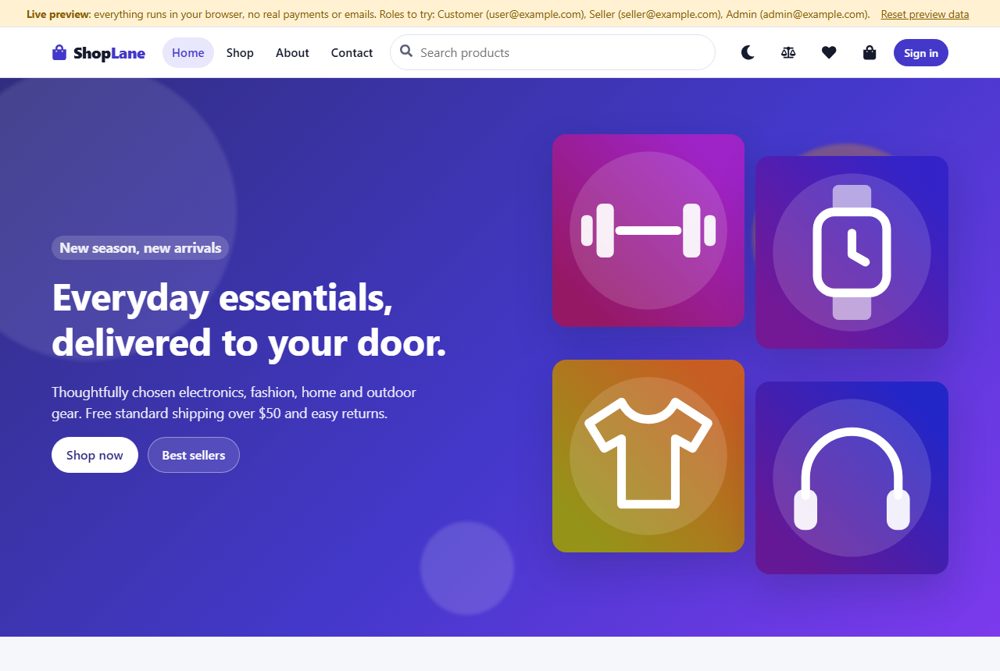
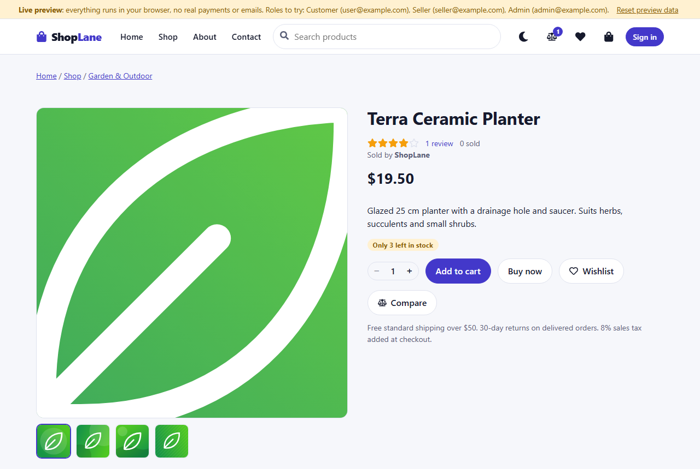
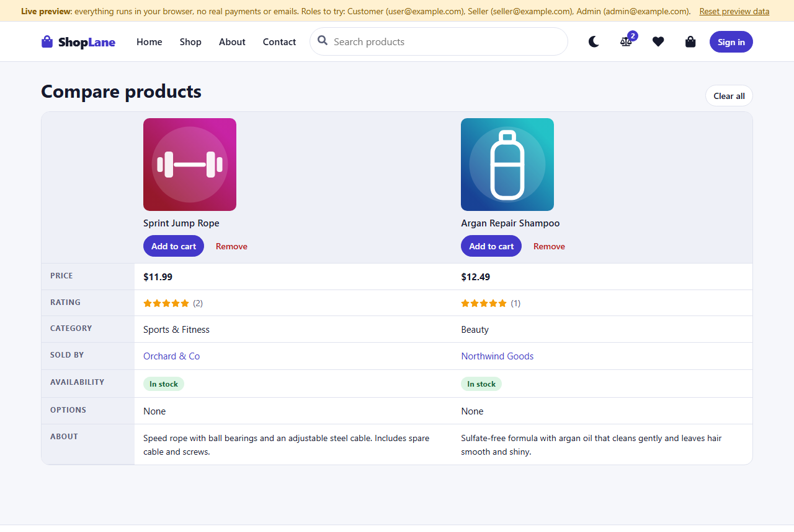
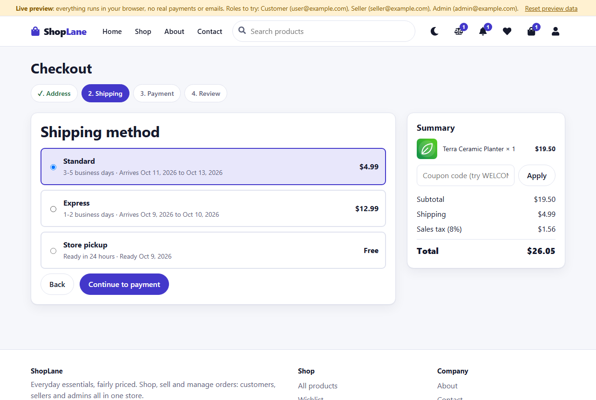
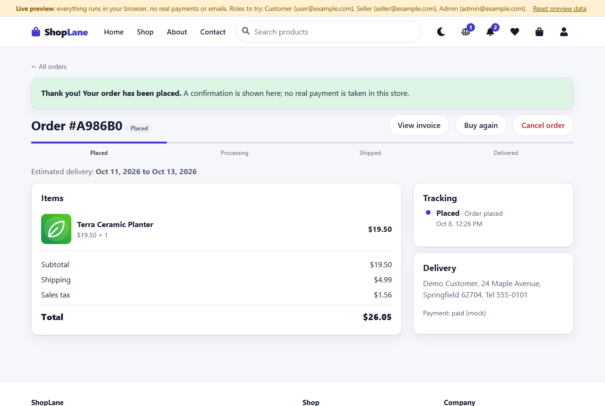
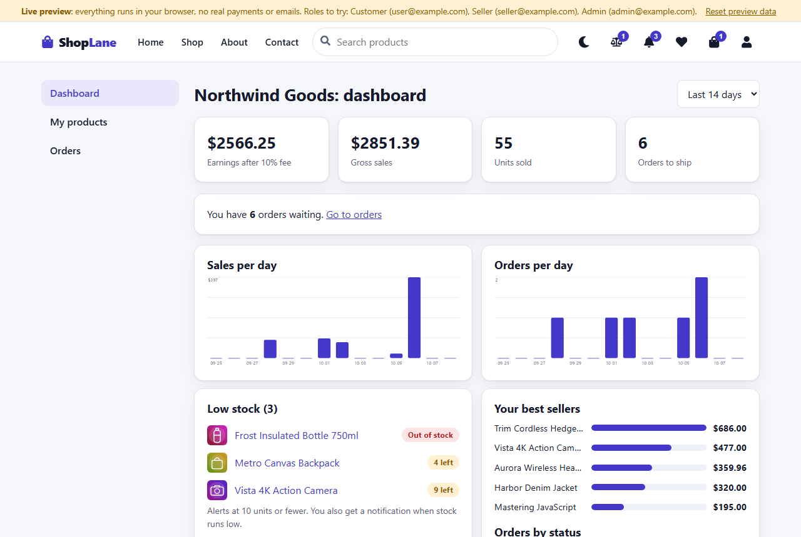
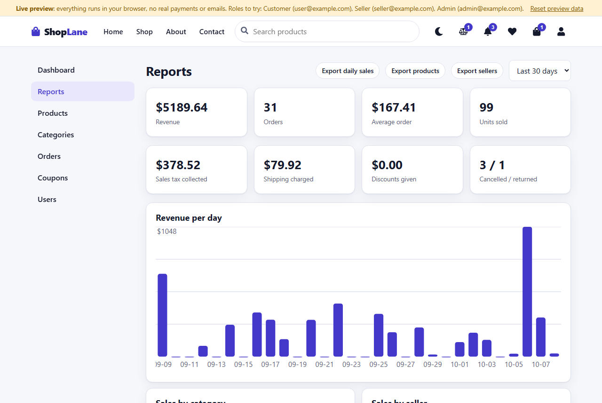

# ShopLane (E-commerce)

A full-stack online store with three roles: shoppers, sellers and admins. A React 19 + Vite client (`Client/`) talks to an Express + Mongoose + JWT API (`/api/v1`) at the repository root. The same UI also runs as a **live preview** that needs no server: an in-browser backend with the same routes, rules and response shapes.

**Live preview:** https://shishir19999.github.io/E-commerce/

Requires Node.js 24 LTS (Docker images: node:24, nginx:1.30, mongo:8.0).



| | |
|---|---|
|  |  |
|  |  |
|  |  |

More: [seller orders](docs/screenshots/desktop-seller-orders.png), [admin dashboard](docs/screenshots/desktop-admin-dashboard.png), [admin orders with a return request](docs/screenshots/desktop-admin-orders.png), [address book](docs/screenshots/desktop-profile.png), [notifications](docs/screenshots/desktop-notifications.png), [dark theme](docs/screenshots/desktop-home-dark.png), phone: [home](docs/screenshots/phone-home.png), [seller dashboard](docs/screenshots/phone-seller-dashboard.png), [cart](docs/screenshots/phone-cart.png).

## Roles

| Role | `role` | How you get it | What you can do |
|---|---|---|---|
| Customer | 0 | Register (always creates a customer) | Browse, search, compare, wishlist, cart with saved-for-later, multi-step checkout with an address book, track and cancel orders, request returns, print invoices, review products and vote reviews helpful, get notifications, apply to become a seller |
| Seller | 2 | Apply on the profile page; an admin approves (Admin > Users) | Own dashboard (earnings after a 10% platform fee, sales charts, low-stock alerts, best sellers), create/edit/delete **only their own** products, see **only the lines of orders that contain their products**, move those orders forward (Processing, Shipped with a tracking number, Delivered), review return requests, get notifications for orders, low stock and reviews, export CSV |
| Admin | 1 | Promoted in Admin > Users or in the database | Everything: dashboard and reports (sales by category, product and seller, coupon usage, tax and shipping totals), all products and orders (any status, return approvals with refund and restock), categories, coupons, users and roles (approve or decline seller applications), CSV export |

Role checks are made on the server from the database on every request, never from the token alone.

## Two ways to run it

### 1. Live preview (no server, no database)

```
cd Client
npm install
npm run dev:demo        # local dev server with the in-browser backend
npm run build:pages     # static build for GitHub Pages -> Client/dist (base path /E-commerce/)
npm run preview:pages   # serve that build locally
```

`VITE_DEMO=true` (set by those scripts) swaps the API layer for an in-browser backend. It seeds 48 products in 8 categories (split between the store and two sellers), reviews, coupons, users, orders (including an open and an approved return), notifications and an address book; it persists to `localStorage`, adds realistic latency and uses a mock payment. A "Live preview" banner is always shown with a **Reset preview data** button. The build uses a hash router, so deep links and refreshes work under the `/E-commerce/` sub-path. Publish the contents of `Client/dist` to the `gh-pages` branch.

**Logins for the live preview** (shown on the sign-in screen as one-click buttons; password `Password123!`):

| Role | Email |
|---|---|
| Customer | `user@example.com` |
| Seller | `seller@example.com` (store "Northwind Goods"); `orchard@example.com` is a second seller |
| Admin | `admin@example.com` |

Coupon codes to try: `WELCOME10` (10% off), `SAVE5` ($5 off over $40), `BIGSPEND25` (25% off over $150). `SUMMER20` is deliberately expired.

### 2. Full stack (Express + MongoDB, optional Stripe test mode)

1. `npm install` in the root and in `Client`.
2. Copy `.env.example` to `.env` and fill in `PORT`, `DEV_MODE`, `MONGODB_URL`, `JWT_SECRET` (a long random secret).
3. Copy `Client/.env.example` to `Client/.env` (`VITE_API_URL`, the API origin, default `http://localhost:8080`).
4. Start MongoDB, then `npm start` (API via `node --watch` plus the Vite client), or `npm run start:server` for the API only.
5. Optional sample data: `npm run seed` (idempotent; `--reset` also clears orders). It creates 12 categories, 84 products (a third sold by the store, the rest by two sellers), 27 users, coupons, 60 orders (one open and one approved return) and starter notifications. Same logins as above (`manager@example.com` is a second admin). Only a few seeded orders are dated relative to today, so their return window is open when you try it.
6. Production client build: `cd Client && npm run build`.

With no `STRIPE_SECRET_KEY` a clearly labelled **mock** payment path is used (orders are marked "paid (mock)"). With a Stripe **test** key, checkout redirects to Stripe Checkout and a webhook marks the order paid. No keys are stored in the repository. The Stripe code is unit-tested with a mocked client only; the live Stripe flow has not been exercised, and approved returns on Stripe orders are marked "refund due (stripe)" to be refunded from the Stripe dashboard.

## Features

- **Catalogue:** category, price slider, rating, in-stock and seller filters, six sort orders, grid/list toggle, pagination, filters kept in the URL, search box with live suggestions (keyboard accessible).
- **Product page:** gallery with thumbnails and hover/tap zoom, variants (colour, size, ...), stock and low-stock badges, discount badges, "sold by" link to the seller's products, reviews with 1-5 stars, rating breakdown, verified-purchase flag, **helpful votes** and review sorting, related products, recently viewed, **compare** button.
- **Compare:** up to four products side by side (price, rating, seller, stock, options), kept in the browser.
- **Cart:** drawer and full page, quantity steppers, coupon codes, **saved for later**, estimated tax, "Buy again" from past orders.
- **Checkout:** four steps (address, shipping, payment, review), **address book** with a default address and "save this address", shipping method with **delivery estimate** (standard / express / pickup, free standard shipping over $50), **8% sales tax**, mock card form with inline validation, live summary. Totals, tax, coupons and stock are always recomputed on the server.
- **Orders:** history, progress bar and tracking timeline, tracking number, estimated delivery, customer cancellation (restocks), **return requests** within 30 days of delivery (approve = restock and refund, or decline), printable invoice with tax.
- **Notifications:** bell with unread count and a full page. Customers hear about order and return updates; sellers about new orders, low stock and reviews; admins about returns, seller applications and low stock.
- **Seller tools:** dashboard, own products (CRUD, stock), orders with only their own lines, earnings, CSV export.
- **Admin tools:** dashboard with attention alerts, **reports** (sales per day, by category, by seller, top products, coupon usage, tax/shipping/discount totals), product CRUD (variants, compare-at price, featured, gallery), categories, orders (status notes, tracking, returns), coupons, users and roles, **CSV export** of orders, products, users and reports.
- **UX:** design tokens, light/dark theme (follows the system, remembered), responsive down to 320px, skeleton loaders, empty and error states, toasts, confirm dialogs, inline form validation, 404 page, lazy-loaded images, skip link, focus states and ARIA labelling. Key pages for every role are checked with axe (no serious or critical issues).

### Parallax and scroll reveal

The home page hero, category banners, featured section background and promo banner use a small parallax and scroll-reveal system (`Client/src/lib/motion.js`): `IntersectionObserver` plus `requestAnimationFrame`, no libraries, only `transform` and `opacity`. It is switched off for `prefers-reduced-motion`, viewports under 768px, data-saver and low-power devices (2 cores or fewer, 2 GB memory or less), and it is never used on the cart, checkout or admin screens.

### Same rules in both modes

`helpers/pricing.js`, `helpers/rules.js` and `helpers/reports.js` contain the shared business rules (shipping, tax, coupons, seller earnings, return window, seller status moves, address validation, report builders). They have no imports and are copied byte for byte to `Client/src/lib/`; a test fails if the two copies differ. The in-browser backend (`Client/src/demo/server.js`) mirrors every route of the Express API and is covered by its own tests.

## Tests and checks

```
npm test                       # API tests (node:test + supertest; needs local MongoDB, throwaway databases dropped afterwards)
cd Client && npm test          # in-browser backend, shared rules, CSV, motion, checkout validation (node:test, no browser)
cd Client && npm run lint && npm run build && npm run build:pages
```

## Client routes

`/` home · `/shop` (filters via query string, `seller=<id>`) · `/product/:slug` · `/cart` · `/compare` · `/login` · `/register` · `/wishlist`, `/profile` (address book, seller application), `/notifications`, `/checkout`, `/checkout/success`, `/checkout/cancel`, `/orders`, `/orders/:id`, `/orders/:id/invoice` (sign-in required) · `/seller`, `/seller/products`, `/seller/orders` (sellers only) · `/admin`, `/admin/reports`, `/admin/products`, `/admin/categories`, `/admin/orders`, `/admin/coupons`, `/admin/users` (admins only). In the live preview the same paths live after `#`.

## Making an admin

Registration always creates role 0 users. Promote one in MongoDB, e.g.
`db.users.updateOne({email:"you@example.com"},{$set:{role:1}})`, then log in again. Admins can also change roles (customer, seller, admin) under Admin > Users, which is also where seller applications are approved.

## API

All responses look like `{ success, message, ... }`. Send `Authorization: Bearer <token>` where auth is required. Roles: customer (C), seller (S), admin (A).

| Method | Path | Access | Notes |
|---|---|---|---|
| POST | `/api/v1/auth/register`, `/login` | public | new users always role 0 |
| GET | `/api/v1/auth/me` | user | 401 if the user was deleted or the token revoked |
| PUT | `/api/v1/auth/profile` | user | name, phone, address (sellers: `storeName`) |
| POST | `/api/v1/auth/seller-request` | customer | `{storeName}`; admins are notified |
| GET/POST/PUT/DELETE | `/api/v1/auth/addresses[/:id]` | user | address book, max 8, exactly one default |
| POST | `/api/v1/auth/logout` | user | bumps `tokenVersion`: earlier tokens stop working |
| GET | `/api/v1/categories` | public | list |
| POST/PUT/DELETE | `/api/v1/categories[/:id]` | admin | delete refused if it has products |
| GET | `/api/v1/products` | public | `page, limit, search, category (id or slug), sort (newest, popular, rating, price_asc, price_desc, name), minPrice, maxPrice, minRating, inStock, featured, seller (id or "store"), ids` |
| GET | `/api/v1/products/:slug`, `/:slug/related` | public | include the seller's name and store name |
| POST/PUT/DELETE | `/api/v1/products[/:id]` | admin or seller | multipart or JSON; sellers only touch their own products (403 otherwise) and cannot set `featured`; photo URL or image file (max 1 MB) |
| GET/POST/DELETE | `/api/v1/reviews[/:id]` | public / user | `GET ?product=<id>&sort=helpful\|newest\|highest\|lowest`; one review per user and product |
| POST | `/api/v1/reviews/:id/helpful` | user | toggles your helpful vote (not on your own review) |
| GET/POST/DELETE | `/api/v1/wishlist[/:productId]` | user | |
| POST | `/api/v1/coupons/validate` | public | `{code, subtotal}` |
| GET/POST/PUT/DELETE | `/api/v1/coupons[/:id]` | admin | |
| GET | `/api/v1/payments/config` | public | `{mode: "stripe" or "mock"}` |
| POST | `/api/v1/payments/checkout` | user | `{items:[{product,quantity,variant?}], shippingAddress, shippingMethod?, couponCode?}`; Stripe: returns `{mode:"stripe", url}`; otherwise the mock order (with `tax`) |
| POST | `/api/v1/payments/webhook` | Stripe signature | paid / expired handling |
| GET | `/api/v1/orders/mine`, `/:id` | user | `/:id`: owner, admin, or a seller of the order (own lines only, with earnings) |
| POST | `/api/v1/orders/:id/cancel` | owner | only before shipping; restocks |
| POST | `/api/v1/orders/:id/return` | owner | `{reason}`; delivered orders within 30 days |
| PUT | `/api/v1/orders/:id/return` | admin or seller of the order | `{decision: "approve"\|"reject", note?}`; approve restocks and refunds |
| GET | `/api/v1/orders` | admin | `page, limit, status, returns=requested` |
| PUT | `/api/v1/orders/:id/status` | admin or seller of the order | `{status, note?, trackingNumber?}`; sellers: forward only to Processing, Shipped, Delivered; cancelling restocks |
| GET | `/api/v1/seller/stats`, `/products`, `/orders` | seller | dashboard numbers, own products, orders with own lines |
| GET | `/api/v1/notifications` | user | latest 30 and the unread count |
| POST/DELETE | `/api/v1/notifications/read-all`, `/:id/read`, `/` | user | mark read / clear |
| GET | `/api/v1/admin/stats`, `/reports?days=` | admin | dashboard series, low stock, open returns, applications; sales report |
| GET/PUT/DELETE | `/api/v1/admin/users[/:id[/role]]` | admin | `role` 0, 1 or 2; filters `role`, `sellerRequest=true`; cannot change or delete yourself |

Uploaded photos are saved in `uploads/` and served at `/uploads/<file>`.

## Payments (Stripe test mode)

Set in `.env`: `STRIPE_SECRET_KEY` (`sk_test_...`), `STRIPE_WEBHOOK_SECRET` (`whsec_...`) and `FRONTEND_URL` (success/cancel redirects go to `$FRONTEND_URL/checkout/success` and `/checkout/cancel`). Forward webhooks locally with
`stripe listen --forward-to localhost:8080/api/v1/payments/webhook` (it prints the `whsec_` value). Test card: 4242 4242 4242 4242.
Stock is reserved when the Stripe order is created and released if the session expires (31 minutes) or Stripe fails to create it.

## Sessions and logout

JWTs carry the user's `tokenVersion`; `POST /api/v1/auth/logout` increments it, so tokens issued before logout (on any device) are rejected. `requireSignIn` also checks that the user still exists, and `isAdmin` reads the role from the database.

## Deploy with Docker

```
export JWT_SECRET=$(openssl rand -hex 32)      # required
# optional: STRIPE_SECRET_KEY, STRIPE_WEBHOOK_SECRET, FRONTEND_URL, VITE_API_URL
docker compose up --build
```

Client (nginx) on http://localhost:8081, API on http://localhost:8080, MongoDB data in the `mongo-data` volume, uploaded photos in the `uploads` volume.
`VITE_API_URL` is baked into the client at build time: set it to the public API URL before building for a real host, and set `FRONTEND_URL` to the public client URL.
Create an admin as described in "Making an admin" (e.g. `docker compose exec mongo mongosh ecommerce --eval 'db.users.updateOne({email:"you@example.com"},{$set:{role:1}})'`), or load sample data with `INSTALL_DEV=true docker compose up --build -d` then `docker compose exec backend npm run seed`.
In production, terminate TLS in front (reverse proxy / load balancer) and restrict CORS.
